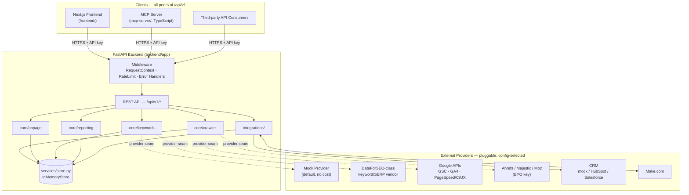
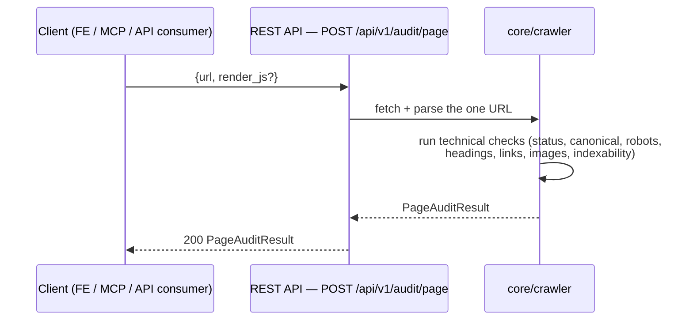
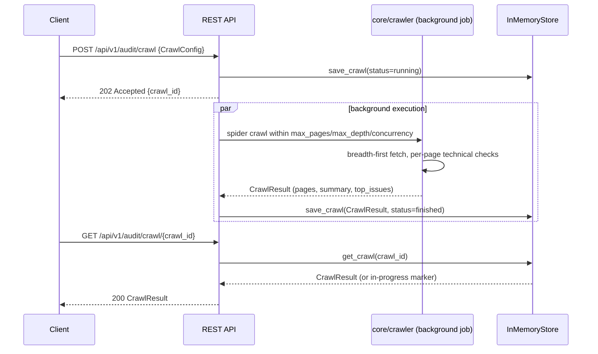
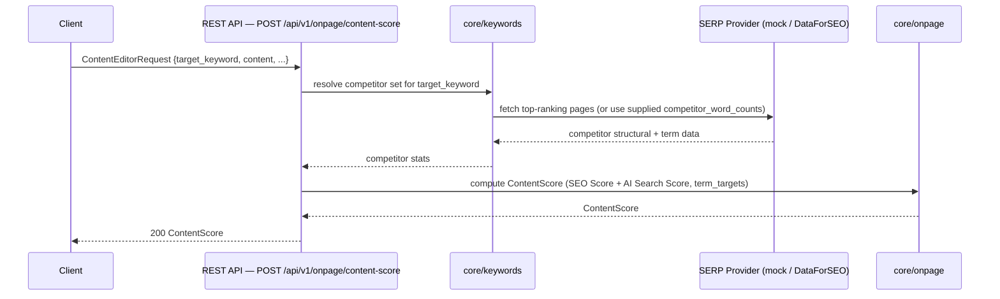
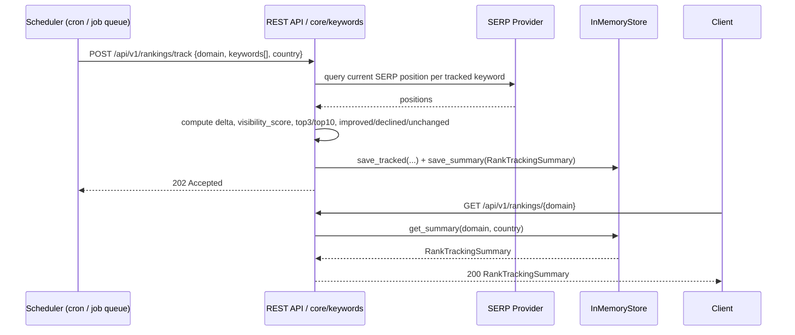
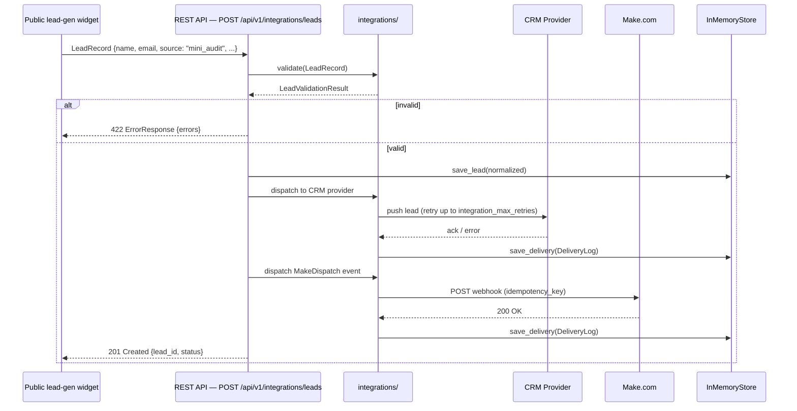
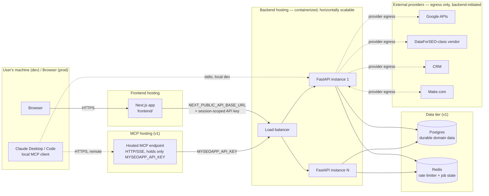

# MySEOapp — System Architecture

*Version 1.0 — 10 July 2026. Companion documents: `spec/PRODUCT_SPEC.md` (product requirements) and `spec/FEATURE_MATRIX.md` (competitive feature inventory). This document defines how MySEOapp is built: monorepo layout, component topology, request flows, the zero-trust and pluggable-provider design rationale, the REST API and MCP tool surfaces, deployment topology, and scaling/observability notes.*

---

## 1. Architecture Principles

1. **Contract-first.** Every capability is a Pydantic model in `backend/app/models/` before it is a route, a UI screen, or an MCP tool. The frontend, the MCP server, and any external API consumer are all peer clients of the same `/api/v1` contract — none gets a private, richer, or faster path into the system.
2. **Zero-trust between components.** No component is trusted because of where it runs. The MCP server and the frontend authenticate to the backend exactly like any third-party API consumer would; every hop is logged with a request id; nothing gets an implicit "internal network" pass. Full rationale in §5.
3. **Decoupled, microservice-shaped monorepo.** Today MySEOapp ships as three independently deployable units — a FastAPI backend, a TypeScript MCP server, and a Next.js frontend — living in one repository for development convenience, but communicating *only* over the documented REST contract. Nothing shares a process, a database connection, or an in-memory cache across those three units.
4. **Pluggable providers everywhere third-party data crosses the boundary.** Keyword/SERP data, GSC/GA4/PageSpeed data, backlink data, CRM delivery — every one of these is resolved from a config flag (`mock` vs. a named real adapter), never hardcoded. See §6.
5. **Explainability and typed failure by default.** Every auto-generated recommendation carries a reasoning string (`AiReview`); every error is a typed `AppError` mapped to a stable, machine-readable code; every 0–100 score is graded by one shared, reused function (`grade_from_score`) so "a B" means the same thing everywhere in the product.

---

## 2. Monorepo Layout

```
MySEOapp/
├── .env.template                  # documented env surface for all three apps
├── .gitignore
│
├── backend/                       # FastAPI engine — Python 3.10+
│   ├── pyproject.toml
│   ├── requirements.txt           # fastapi, uvicorn, pydantic v2, pydantic-settings,
│   │                               # httpx, beautifulsoup4, lxml, pytest/respx
│   ├── app/
│   │   ├── config.py               # Settings (pydantic-settings, SEO_ env prefix)
│   │   ├── logging_config.py       # structured JSON logging (JsonFormatter)
│   │   ├── version.py              # __version__, API_VERSION
│   │   ├── api/                    # FastAPI routers — /api/v1/* (wiring in progress)
│   │   ├── core/                   # the four SEO engines
│   │   │   ├── crawler/            # Screaming Frog-style crawl/audit engine
│   │   │   ├── onpage/             # Rank Math rule engine + Surfer scoring
│   │   │   ├── keywords/           # HikeSEO-style keyword/SERP/rank engine
│   │   │   └── reporting/          # action-plan + white-label reporting engine
│   │   ├── integrations/           # Make.com gateway, CRM lead pipeline, webhooks
│   │   ├── middleware/
│   │   │   ├── context.py          # RequestContextMiddleware (request id + timing)
│   │   │   ├── errors.py           # AppError hierarchy → ErrorResponse
│   │   │   └── rate_limit.py       # RateLimitMiddleware (fixed-window)
│   │   ├── models/                 # the shared data contract — see §7/§8 and PRODUCT_SPEC §6
│   │   │   ├── common.py, audit.py, onpage.py, keywords.py,
│   │   │   │   reporting.py, integrations.py, api.py
│   │   ├── services/
│   │   │   └── store.py            # InMemoryStore — the persistence seam
│   │   └── utils/
│   │       ├── html.py             # shared HTML parsing (BeautifulSoup)
│   │       ├── text.py             # tokenization, density, Flesch readability
│   │       └── url.py              # URL normalization, registrable-domain logic
│   └── tests/
│
├── mcp-server/                    # TypeScript MCP server — thin REST client
│   ├── src/                        # tool definitions (one per REST capability, §9)
│   └── test/
│
├── frontend/                      # Next.js dashboard (React)
│   └── src/                        # dashboard shell, crawl/content/rankings/report views
│
└── docs/
    ├── ARCHITECTURE.md             # this file
    ├── research/                   # four competitor research dossiers
    └── spec/
        ├── PRODUCT_SPEC.md
        └── FEATURE_MATRIX.md
```

**Why one repo, three deployables.** Sharing a repo keeps the Pydantic models (the single source of truth for every contract) visible to whoever is writing the MCP tool schemas or the frontend API client, without needing a package registry or a submodule. It does **not** mean shared runtime code, a shared database connection, or a shared deploy — see §9 for how the three units are actually deployed and scaled independently.

---

## 3. Component Diagram



Every arrow into the backend crosses through `Middleware` — there is no path that reaches `core/*` or `integrations/` without first passing request-id tagging, rate limiting, and the typed-error boundary. Every arrow leaving the backend toward a `Provider` originates from `core/crawler`, `core/keywords`, or `integrations/` only — the frontend and MCP server never hold provider credentials and never call a provider directly.

---

## 4. Request Flows

Five representative flows, matching the product's highest-traffic operations.

### 4.1 Single-page audit



A single-page audit is synchronous — it never touches the store or a background job, since one page's worth of fetch-and-parse work fits comfortably inside a normal HTTP request/response cycle. This is the endpoint the public lead-gen audit widget (§4.5, and `FEATURE_MATRIX.md` §4 row 18) is built on.

### 4.2 Full crawl (async submit → poll)



A full crawl is **always** submit-then-poll, never a blocking call — `CrawlConfig.max_pages` goes up to 100,000, and no HTTP client (browser, MCP client, or third-party integrator) should hold a connection open for that long. `crawl_id` is the handle every subsequent call (poll, compare, report-build) keys off.

### 4.3 Content scoring



The competitor-resolution step is what makes this Surfer-equivalent rather than a fixed-rule scorer: targets (word count, headings, term usage ranges) are derived from the live competitor set on every call, not a static formula. When `competitor_word_counts` is supplied directly in the request, the `PROV` round-trip is skipped — useful for the MCP/API path when a caller already has its own competitor data.

### 4.4 Rank tracking poll



The scheduler is external to the request/response cycle by design (v1: a queue-triggered job; MVP: any cron-style trigger calling the same public endpoint) — `rankings/track` and `rankings/{domain}` are decoupled so a write (poll + store) and a read (fetch latest summary) never block on each other, and a dashboard can poll `GET rankings/{domain}` as often as it likes without ever triggering a paid provider call itself.

### 4.5 Lead capture → CRM / Make.com



This is the one endpoint intentionally reachable without the standard API-key requirement (it's embedded in a public marketing page), so it carries its own stricter controls instead: aggressive per-IP rate limiting, server-side validation before anything touches the store, and every downstream dispatch — CRM push and Make.com event — going through the same `DeliveryLog`-audited, retrying pipeline as any other integration call. See §5 for why this endpoint still cannot reach a provider directly.

---

## 5. Zero-Trust / Decoupled-Microservice Rationale

**Why the MCP server has no database access.** `mcp-server/` holds exactly one secret — `MYSEOAPP_API_KEY` — and calls the same `/api/v1` endpoints a logged-in browser session would. A compromised or buggy MCP process can therefore only do what an authenticated API caller could already do through the documented contract; it cannot read another tenant's data, bypass rate limits, or reach a provider credential, because it never had one. This is the direct, load-bearing consequence of the "MCP tools are thin wrappers, not a second implementation" rule in `PRODUCT_SPEC.md` §4.7.

**Why the frontend never talks to providers directly.** GSC, GA4, DataForSEO, Ahrefs/Moz, CRM, and Make.com credentials live only in the backend's environment (`Settings`, sourced from `SEO_`-prefixed env vars). The browser bundle never contains a provider secret. This has two effects beyond the obvious security one: a provider's rate-limit policy or auth-flow change is a backend-only fix (no frontend redeploy), and provider cost is fully observable and controllable in one place (`integrations/` + `core/crawler`/`core/keywords` adapters) rather than scattered across client code.

**Why inbound webhook signatures matter.** `/api/v1/integrations/webhooks/make` is reachable from the public internet by design — Make.com needs to be able to call it. Every inbound payload is HMAC-SHA256-verified against `Settings.webhook_signing_secret` before it is treated as trusted input (`WebhookEvent.verified`). An unverified event is logged and dropped, never dispatched into `core/reporting` or `core/keywords` processing — this is the inbound mirror of the API-key requirement on outbound-facing endpoints.

**Per-module network egress boundaries.** Only `integrations/` and the specific provider-adapter code inside `core/crawler` and `core/keywords` are allowed to make outbound calls to third-party hosts. `core/onpage` and `core/reporting` never make an outbound network call at all — they operate purely on data already resolved by the other two engines or supplied in the request. This containment makes "what in this codebase can reach the public internet" a small, auditable list rather than a codebase-wide question.

**Least-privilege, independently rotatable credentials.** Every third-party integration — GA4, GSC, DataForSEO login/password, PageSpeed/Google API key, Ahrefs/Moz/Majestic keys, CRM API key, Make.com signing secret, the inbound webhook signing secret — is its own config value, rotatable independently. A compromised CRM key cannot be used to pull GSC data; a leaked Make.com signing secret cannot be used to call DataForSEO. `.env.template` documents every one of these as a distinct, named variable rather than a single bundled "provider credentials" blob.

**"Decoupled microservice" in practice, not just in name.** The three deployable units (backend, MCP server, frontend) share a repository but nothing at runtime: no shared process, no shared database connection pool, no shared in-memory cache, no shared secret beyond the API key each non-backend client is issued. That means the crawl engine can later be pulled out into its own horizontally-scaled worker fleet (see §10), or the MCP server can be redeployed independently of a frontend release, without any of the other two units needing to change — the only contract that has to hold steady is `/api/v1`, and that contract is generated from the same Pydantic models the backend already runs against, so it cannot silently drift.

---

## 6. Pluggable Provider Pattern (mock vs. real adapters)

Every external data source is resolved through a **config flag, not a code path**:

| Config flag | Default | Real adapter examples |
|---|---|---|
| `SEO_KEYWORD_PROVIDER` | `mock` | `dataforseo` |
| `SEO_SERP_PROVIDER` | `mock` | `dataforseo` |
| `SEO_CRM_PROVIDER` | `mock` | `hubspot`, `salesforce` |
| *(reserved)* `SEO_GSC_CREDENTIALS_JSON`, `SEO_GOOGLE_API_KEY`, `SEO_DATAFORSEO_LOGIN`/`PASSWORD` | unset | credentials consumed by the adapter named above once wired |

**The intended shape.** Each pluggable domain (keyword research, SERP analysis, CRM delivery) is defined as a small Protocol/interface — for example, a `SerpProvider` with a single `analyze(keyword, country, device) -> SerpAnalysis` method — and `core/keywords`/`integrations/` depend only on that interface, never on a concrete vendor SDK. A `MockSerpProvider` returns deterministic fixture data (same keyword in, same shape out, every time); a `DataForSEOProvider` implements the identical interface against the real vendor API. Which one gets constructed is decided once, at process startup, by reading the config flag — no `if provider == "dataforseo"` branching anywhere inside the engines themselves.

**Why this matters operationally:**
- **Local dev and CI run entirely on `mock`.** No paid API key is required to run the test suite or develop a new feature — `respx` (already in `backend/requirements.txt`) intercepts the HTTP layer so even adapter code itself is tested against realistic HTTP responses without live network calls or provider cost.
- **Swapping providers is a config change, not a redeploy of calling code.** Moving `SEO_SERP_PROVIDER` from `mock` to `dataforseo` in production requires the new adapter class and credentials — `core/keywords`, the REST routes, and the MCP tool built on top of them are all untouched.
- **This generalizes Screaming Frog's own "bring your own API key" pattern** (Ahrefs/Majestic/Moz backlink import, `FEATURE_MATRIX.md` §1 row 51) into a systemic architectural rule applied to *every* external data source in the product, not just backlinks — the same pattern covers keyword/SERP data, GSC, GA4, PageSpeed, and CRM delivery.
- **Cost containment.** Because every provider call is funneled through one named adapter per domain, request volume, cache-hit rate, and spend against a given vendor are all observable in one place (see §10 caching notes), rather than scattered across ad hoc call sites.

---

## 7. REST API Surface (`/api/v1`)

| Method | Path | Purpose | Request → Response | Auth |
|---|---|---|---|---|
| POST | `/api/v1/audit/page` | Single-page technical audit (synchronous) | request (url, render_js?) → `PageAuditResult` | API key |
| POST | `/api/v1/audit/crawl` | Submit a full site crawl (async — see §4.2) | `CrawlConfig` → `{crawl_id, status}` (202) | API key |
| GET | `/api/v1/audit/crawl/{id}` | Poll/fetch crawl status and results | — → `CrawlResult` | API key |
| POST | `/api/v1/audit/sitemap` | Generate or audit an XML sitemap | request (start_url or crawl_id) → `list[SitemapUrl]` | API key |
| POST | `/api/v1/onpage/analyze` | Rule-based on-page scoring (Rank Math parity) | `OnPageRequest` → `OnPageResult` | API key |
| POST | `/api/v1/onpage/content-score` | Dual SEO/AI Search content score (Surfer parity) | `ContentEditorRequest` → `ContentScore` | API key |
| POST | `/api/v1/onpage/schema` | Generate JSON-LD structured data | `SchemaRequest` → `SchemaResult` | API key |
| POST | `/api/v1/keywords/research` | Keyword research and SERP-overlap clustering | `KeywordResearchRequest` → `KeywordResearchResult` | API key |
| POST | `/api/v1/keywords/serp` | SERP analysis for one keyword/country/device | request (keyword, country, device) → `SerpAnalysis` | API key |
| POST | `/api/v1/rankings/track` | Register/refresh tracked keywords for a domain (see §4.4) | request (domain, keywords[], country) → `RankTrackingSummary` or `202` | API key |
| GET | `/api/v1/rankings/{domain}` | Fetch the current rank-tracking summary | — (query: `country`) → `RankTrackingSummary` | API key |
| POST | `/api/v1/reports/action-plan` | Generate/refresh a site's prioritized task list | request (site, sources[]) → `ActionPlan` | API key |
| POST | `/api/v1/reports/build` | Build a branded, shareable report | request (site, period, branding?, sections[]) → `Report` | API key |
| POST | `/api/v1/integrations/leads` | Capture, validate, and dispatch a lead (see §4.5) | `LeadRecord` → `{lead_id, status}` (201) | Public, rate-limited* |
| GET | `/api/v1/integrations/deliveries` | List outbound delivery logs | — (query: target, status) → `list[DeliveryLog]` | API key |
| POST | `/api/v1/integrations/webhooks/make` | Inbound Make.com webhook receiver | `WebhookEvent` (+ signature header) → `{received: true}` | HMAC signature |
| GET | `/health` | Liveness/readiness probe | — → `HealthResponse` | None |
| GET | `/version` | Build/version info for deploy verification | — → `VersionResponse` | None |

\* `integrations/leads` is the one deliberate exception to API-key auth — it's designed to be called from a public, embeddable lead-gen audit widget (`FEATURE_MATRIX.md` §4 row 18). It compensates with tighter per-IP rate limiting and full server-side validation (`LeadValidationResult`) before anything is persisted or dispatched.

All request/response bodies above are named Pydantic models already defined in `backend/app/models/`, with the exception of a handful of thin request wrappers (page-audit input, sitemap-request input, SERP-request input, rankings-track input, action-plan/report-build input) that compose existing field-level types (reusing `Device`, `SearchIntent`, etc. from `common.py`) and are scoped for the API-wiring build step rather than already present as standalone classes.

### Endpoints reserved for v1 (implied by the data model, not required at MVP)

These aren't in the MVP-required list above but fall directly out of models that already exist, and are the natural next additions:

| Method | Path | Backed by |
|---|---|---|
| GET | `/api/v1/audit/crawl/{id}/compare?against={id}` | `CrawlComparison` |
| GET | `/api/v1/audit/crawls` | `InMemoryStore.list_crawls()`, paginated via `Page[CrawlResult]` |
| GET | `/api/v1/reports/{report_id}` | `InMemoryStore.get_report()` |
| GET | `/api/v1/reports/action-plan/{site}` | `InMemoryStore.get_plan()` |

---

## 8. MCP Tool Surface

The MCP server (`mcp-server/`) exposes one tool per primary REST capability. Every tool is a thin, typed wrapper: it validates input against the same shape the REST endpoint expects, calls `MYSEOAPP_API_BASE_URL` with `MYSEOAPP_API_KEY`, and returns the REST response — no business logic lives in `mcp-server/` itself (see §5).

| MCP Tool | Wraps | Purpose |
|---|---|---|
| `audit_page` | `POST /api/v1/audit/page` | Run a single-page technical audit |
| `start_crawl` | `POST /api/v1/audit/crawl` | Kick off a full site crawl; returns `crawl_id` immediately |
| `get_crawl_status` | `GET /api/v1/audit/crawl/{id}` | Poll a crawl for progress/completion |
| `generate_sitemap` | `POST /api/v1/audit/sitemap` | Generate or audit an XML sitemap |
| `analyze_onpage` | `POST /api/v1/onpage/analyze` | Run the rule-based on-page checklist |
| `score_content` | `POST /api/v1/onpage/content-score` | Compute the dual SEO/AI Search content score |
| `generate_schema` | `POST /api/v1/onpage/schema` | Generate JSON-LD structured data |
| `research_keywords` | `POST /api/v1/keywords/research` | Keyword research and clustering |
| `analyze_serp` | `POST /api/v1/keywords/serp` | Analyze a keyword's current SERP |
| `track_rankings` | `POST /api/v1/rankings/track` | Register/refresh tracked keywords |
| `get_rankings` | `GET /api/v1/rankings/{domain}` | Fetch a domain's rank-tracking summary |
| `build_action_plan` | `POST /api/v1/reports/action-plan` | Generate/refresh a prioritized task list |
| `build_report` | `POST /api/v1/reports/build` | Build a branded client report |
| `capture_lead` | `POST /api/v1/integrations/leads` | Submit a lead for CRM/Make dispatch |
| `list_deliveries` | `GET /api/v1/integrations/deliveries` | Check outbound delivery status |

**Design rules governing this surface:**
- **Long-running actions are always a submit/poll pair.** `start_crawl` + `get_crawl_status` mirrors the REST-level async pattern in §4.2 — no MCP tool blocks for the duration of a crawl.
- **Transport.** stdio is the default (spawned locally by Claude Desktop/Claude Code, pointed at a local or remote `MYSEOAPP_API_BASE_URL`); a hosted HTTP/SSE MCP endpoint is reserved for v1 to support remote/shared-agent access without requiring a local process per user.
- **Auth.** The MCP server holds exactly one secret, `MYSEOAPP_API_KEY` — never a database credential, never a provider credential. A missing/invalid key surfaces as a clear MCP tool error, not a silent failure.
- **Introspectability.** The tool list and each tool's input schema are discoverable at runtime (mirroring Screaming Frog's own markdown tool-doc export capability) so an agent — or a developer — can enumerate the surface without reading `mcp-server/src`.
- **Why this is a genuine differentiator, not a checkbox.** Screaming Frog's MCP server is the closest competitor precedent, but it's explicitly partial (list-mode crawling still unsupported as of its latest release) and, being bound to a desktop install, can only ever control the user's own machine. Rank Math's MCP is scoped to a single WordPress site via the WordPress Abilities API. MySEOapp is the only product in the comparison set built against a cloud-native, multi-tenant REST API from the outset — which is what makes a *hosted, remotely callable* MCP endpoint (not just "point an agent at my own laptop") viable at all.

---

## 9. Deployment Topology



**Development.** All three units run as local processes: `uvicorn` serves the backend on `:8000`; `next dev` serves the frontend on `:3000` with `NEXT_PUBLIC_API_BASE_URL=http://localhost:8000`; the MCP server runs over stdio, spawned directly by a local Claude Desktop/Code MCP configuration pointed at the same local backend via `MYSEOAPP_API_BASE_URL`. Persistence is the in-process `InMemoryStore` — no external database required to develop or run tests.

**Staging / Production.**
- **Backend** ships as a container (FastAPI + Uvicorn/Gunicorn workers), deployed to a container platform (e.g., Fly.io/Render/Cloud Run/ECS-class), horizontally scaled behind a load balancer. Secrets (`SEO_*` env vars — provider credentials, signing secrets, CRM keys) are injected via the platform's secret manager, never committed or baked into an image.
- **Frontend** deploys as a standard Next.js app (Vercel-class platform, or containerized alongside the backend). It only ever holds the *public* `NEXT_PUBLIC_API_BASE_URL` and a browser-session-scoped API key obtained through login — never a raw, long-lived backend API key in client-side code.
- **MCP server** runs in two modes side by side: (a) a local stdio process distributed to individual developers/users for Claude Desktop/Code — the common case near-term — and (b) a small, separately deployed hosted HTTP/SSE MCP container (v1) for remote/shared-agent access, holding only `MYSEOAPP_API_KEY` and nothing else.
- **Persistence** moves from `InMemoryStore` to Postgres (durable domain data — crawls, tasks, reports, leads, delivery logs) plus Redis (the rate limiter's shared window store, and short-lived crawl-job/queue state) in v1, exactly matching the "small persistence seam" the store module was deliberately designed around.
- **External providers** are reached only from backend instances, never from the frontend or MCP hosting tier — this is the deployment-level enforcement of the zero-trust rule in §5.
- **Environment separation.** Dev/staging/prod each resolve their own `Settings` from their own env, with their own provider credentials and rate-limit budgets; `Settings.is_production` gates stricter behavior (e.g., a real CORS allow-list instead of the dev-default `["*"]`).

---

## 10. Scaling & Observability Notes

**Structured logging.** Every log line is single-line JSON (`JsonFormatter` in `logging_config.py`) — `timestamp`, `level`, `logger`, `message`, plus whatever structured `extra` fields the call site attaches — so any log aggregator (Datadog, CloudWatch, Loki, etc.) ingests it without a custom parser. `SEO_LOG_JSON=false` switches to a human-readable formatter for local development.

**Request correlation.** `RequestContextMiddleware` assigns (or echoes) an `X-Request-ID` on every request, logs method/path/status/`duration_ms` against it, and threads it through to every `ErrorResponse`. This is deliberately the seam an OpenTelemetry trace ID would later plug into — the request-id-per-log-line pattern doesn't need to change when formal distributed tracing is added, only extended.

**Rate limiting at scale.** `RateLimitMiddleware` is a fixed-window limiter (`threading.Lock`-guarded in-process dict) — correct for a single backend instance, but it would under-count (allow too much traffic) once the backend runs as multiple replicas behind a load balancer, since each replica would track its own window independently. The v1 swap to a Redis-backed shared window store (§9) closes this gap without changing the middleware's external behavior (headers, 429 semantics, exempt paths all stay identical).

**Horizontal scaling of crawl workers.** Crawling is the most resource-intensive operation in the product — sustained outbound HTTP concurrency today, headless-browser rendering once JS rendering ships (v1). The scaling path is a queue-based worker pool: `POST /api/v1/audit/crawl` enqueues a job and returns `202` immediately (already true at the API-contract level per §4.2); v1 moves the actual execution off the API-serving process into a pool of crawl workers that pull from the queue, so crawl throughput scales independently of how many replicas are serving synchronous API traffic.

**Caching strategy.** SERP and keyword provider responses are cached (v1) keyed by `(keyword, country, device)` within a bounded TTL, so repeated requests for the same keyword don't re-bill a paid provider call — directly protecting the per-call cost risk flagged in `PRODUCT_SPEC.md` §10.

**Error taxonomy.** The `AppError` hierarchy (`NotFoundError`→404, `BadRequestError`→400, `ValidationFailedError`→422, `RateLimitError`→429, `ProviderError`→502) maps every failure mode to a stable HTTP status and a machine-readable `code`, always delivered as an `ErrorResponse`. This is what lets the frontend, the MCP server, and any external API consumer branch reliably on `error` codes instead of parsing human-readable message text — a prerequisite for the MCP server surfacing "clear, actionable" tool errors per §8.

**Health, version, and deploy verification.** `/health` and `/version` are deliberately unauthenticated and exempt from rate limiting (`RateLimitMiddleware` hardcodes this exemption), so uptime monitors and deploy-verification scripts are never throttled or blocked. `/version` returns the running `__version__`/`API_VERSION` (`backend/app/version.py`), so a deployment can be confirmed live without shell access to the host.

**What's already real vs. what's designed-but-pending.** As of this writing, the middleware stack (`RequestContextMiddleware`, `RateLimitMiddleware`, the `AppError`→`ErrorResponse` exception handlers), structured JSON logging, the `Settings` configuration surface, and the `InMemoryStore` persistence seam are fully implemented and reviewable in `backend/app/`. The four core engines (`core/crawler`, `core/onpage`, `core/keywords`, `core/reporting`), the `integrations/` package, the `/api/v1` route wiring, the MCP server, and the frontend are scaffolded — their data contracts exist in `backend/app/models/`, but the executing logic described throughout this document is under active build. This document describes the target architecture those pieces are being built against, not a fully shipped system.

---

## Cross-References

- Product requirements, personas, module specs, roadmap: `spec/PRODUCT_SPEC.md`
- Full competitive feature inventory (224 features): `spec/FEATURE_MATRIX.md`
- Source research: `research/{screaming-frog,surfer-seo,rank-math,hikeseo}-features.md`
- Backend contracts referenced throughout: `../backend/app/models/*.py`, `../backend/app/config.py`, `../backend/app/middleware/*.py`, `../backend/app/logging_config.py`, `../backend/app/services/store.py`
