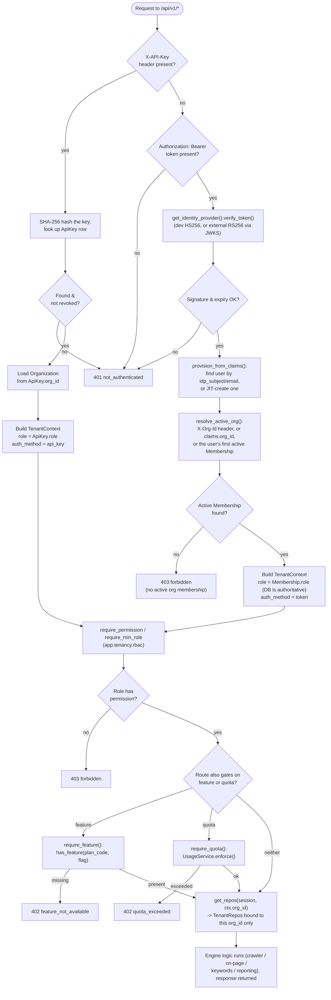

# MySEOapp — Multi-Tenancy Model

*Companion documents: `AUTH_AND_BILLING.md` (identity, RBAC, plans, quotas), `../SYSTEM_STATE.md` (module inventory), `spec/PRODUCT_SPEC.md` (product requirements). This document defines how one MySEOapp deployment safely serves many independent organizations from a single database.*

---

## 1. The Tenancy Model

MySEOapp is a **single deployment, single database, row-level multi-tenant** system: every customer ("organization") shares the same Postgres/SQLite instance, the same FastAPI process, and the same tables. Isolation is not a network boundary or a separate schema — it is a column.

- Every tenant-owned table carries an `org_id` foreign key.
- No route or engine module is allowed to query the database directly. All reads and writes for tenant data go through `backend/app/tenancy/repositories.py` (`TenantRepos`), which is constructed with exactly one `org_id` and silently refuses to return or mutate a row that belongs to a different organization.
- The `org_id` itself is never taken from client input (a request body or query string). It is resolved once per request, from a verified credential, by the auth dependency layer (`backend/app/tenancy/deps.py`), and carried for the rest of the request inside an immutable `TenantContext`.

This gives MySEOapp most of the operational simplicity of a single-tenant app (one schema to migrate, one connection pool, one set of indexes to tune) while keeping tenant data provably separated at the query layer. The trade-off, made deliberately for the current stage of the product, is discussed in §5: row-level isolation shares physical storage and blast radius across tenants, which is why the repository layer exists as the one seam that would need to change if that trade-off stops being acceptable.

### Why row-level isolation now

- **Single migration surface.** One `SQLModel.metadata.create_all()` (today) or one Alembic migration chain (once added — see `../SYSTEM_STATE.md` known debt) instead of N per-tenant schemas to keep in sync.
- **Cheap tenant creation.** Signing up a new organization is an `INSERT`, not a schema/database provisioning step — this matters because the product's onboarding flow (see `AUTH_AND_BILLING.md` §3) is meant to be instant and self-serve.
- **Cross-tenant operational queries stay possible** (billing reconciliation, usage analytics, support tooling) without cross-database joins.
- **It is the same pattern SQLite-backed dev/test already needs.** The backend runs on SQLite by default (`SEO_DATABASE_URL=sqlite:///./myseoapp.db`) and Postgres in production via the same `SQLModel` definitions — SQLite has no concept of schemas, so schema-per-tenant could not be the default dev story anyway.

---

## 2. Data Model

Tables fall into three groups, all defined with SQLModel and created by `app.db.session.init_db()`. Every table below except the two control-plane tables noted carries `org_id: str` (indexed).

### 2.1 Identity & organization tables — `backend/app/db/models_tenancy.py`

| Table | Key fields | `org_id`? | Notes |
|---|---|---|---|
| `users` | `id`, `email` (unique), `full_name`, `idp_provider`, `idp_subject`, `password_hash`, `is_active`, `is_superuser` | No — a user is a person, not a tenant row | One user account can hold a `Membership` in many organizations (the agency multi-client model — see `AUTH_AND_BILLING.md` §3). `password_hash` is only ever populated for the built-in `dev` IdP. |
| `organizations` | `id`, `name`, `slug` (unique), `plan_code`, `billing_customer_id`, `public_audit_token`, `settings` (JSON) | Is the tenant | The tenant root. `plan_code` is denormalized here (also tracked on `Subscription`) so `TenantContext.plan_code` is a single cheap lookup on every request. |
| `memberships` | `id`, `org_id`, `user_id`, `role`, `status` | Yes | Join table between `users` and `organizations`; unique on `(org_id, user_id)`. `role` is one of the RBAC roles (`AUTH_AND_BILLING.md` §1.4). This is the row that makes "one login, many client workspaces" possible. |
| `invites` | `id`, `org_id`, `email`, `role`, `token` (unique), `status`, `invited_by`, `expires_at` | Yes | Pending team/client invitations; redeemed via `POST /orgs/invites/accept`, which turns an invite into a `Membership`. |
| `api_keys` | `id`, `org_id`, `user_id`, `name`, `prefix`, `last4`, `hash` (unique), `role`, `scopes`, `revoked`, `last_used_at` | Yes | Self-hosted API keys. Only the SHA-256 `hash` is stored — see `AUTH_AND_BILLING.md` §1.5. |

### 2.2 Billing tables — `backend/app/db/models_billing.py`

| Table | Key fields | `org_id`? | Notes |
|---|---|---|---|
| `subscriptions` | `id`, `org_id` (unique), `plan_code`, `status`, `provider`, `provider_customer_id`, `provider_subscription_id`, `seats`, `current_period_start/end`, `cancel_at_period_end` | Yes (1:1) | One row per org. Plan *definitions* (price, limits, features) live in code (`app.billing.plans`), not the database — this table only tracks which plan an org is on and its provider state. |
| `usage_records` | `id`, `org_id`, `metric`, `period`, `count` | Yes | Unique on `(org_id, metric, period)`. `period` is `"YYYY-MM"` for monthly-reset metrics or `"total"` for absolute counters. This is the quota-metering ledger — see `AUTH_AND_BILLING.md` §2.2. |

### 2.3 SEO / product tables — `backend/app/db/models_seo.py`

| Table | Key fields | `org_id`? | Notes |
|---|---|---|---|
| `projects` | `id`, `org_id`, `name`, `domain`, `settings` (JSON) | Yes | A tracked site/workspace within an org. |
| `crawl_records` | `id` (= `CrawlResult.crawl_id`), `org_id`, `project_id`, `start_url`, `summary` (JSON), `data` (JSON) | Yes | Full `CrawlResult` Pydantic model round-tripped as JSON; `summary` is duplicated as its own JSON column so list views don't need to deserialize the whole payload. |
| `ranking_records` | `id`, `org_id`, `project_id`, `domain`, `country`, `data` (JSON) | Yes | Unique on `(org_id, domain, country)` — rank-tracking summaries are keyed per tenant, so two orgs tracking the same domain never collide. |
| `report_records` | `id` (= `Report.report_id`), `org_id`, `project_id`, `site`, `data` (JSON) | Yes | White-label client reports. |
| `action_plan_records` | `id`, `org_id`, `site`, `data` (JSON) | Yes | Generated `ActionPlan`s. |
| `leads` | `id`, `org_id`, `project_id`, `name`, `email`, `phone`, `company`, `website`, `source`, `status`, `data` (JSON) | Yes | Structured columns (not just JSON) so leads can be queried/filtered per tenant without deserializing. |
| `delivery_logs` | `id`, `org_id`, `lead_id`, `target`, `status`, `attempts`, `last_error` | Yes | Outbound CRM/Make.com delivery audit trail. |

**Convention:** engine outputs stay Pydantic-model-shaped (the model files under `backend/app/models/`) end to end; the tenancy layer only adds an `org_id` envelope and a JSON column around them, rather than re-normalizing every engine field into its own SQL column. This keeps the engines (crawler, on-page, keywords, reporting) completely unaware that multi-tenancy exists — they still take and return plain Pydantic models, exactly as in the pre-SaaS build.

---

## 3. Request Flow: Token/Key → Org → Tenant-Scoped Repos

Every authenticated request resolves a `TenantContext` exactly once, at the very start of the route's dependency chain, and every downstream dependency (permission checks, quota checks, repository access) reads from that one object. There are two credential paths in:

1. **`X-API-Key` header** — a self-hosted secret, hashed and looked up directly; resolves an org and a fixed role in one step, no user session involved.
2. **`Authorization: Bearer <token>`** — a JWT verified by the configured identity provider; resolves a `User` (creating one just-in-time if this is the first time this identity has been seen), then resolves which `Organization` that user is acting as right now.

**Key properties of this flow:**

- **The org is never client-asserted.** For token auth, the caller may *hint* which org they mean (`X-Org-Id` header, or an `org_id` claim baked into a previously-issued token), but the actual grant comes from a `Membership` row looked up server-side. For API-key auth, the org is fixed at key-creation time and cannot be overridden by the caller at all.
- **Role is always re-read from the database for token auth**, not trusted from the JWT payload — `_context_from_token` in `app/tenancy/deps.py` explicitly re-fetches the `Membership.role` after resolving the org, so a role downgrade takes effect immediately even against an unexpired token.
- **RBAC and billing gates compose as ordinary FastAPI dependencies** (`require_permission`, `require_min_role`, `require_feature`, `require_quota`), so a route can stack "must be at least EDITOR" *and* "must be on a plan with `content_ai`" *and* "must be under the `content_scores_per_month` quota" without any bespoke per-route logic — see `routes_onpage.py::content_score_route` for a live example combining a permission with a quota.

---

## 4. Isolation Enforcement — Belt and Suspenders

The repository layer (`app/tenancy/repositories.py::TenantRepos`) is the *only* place tenant data is read or written, and it enforces isolation twice:

1. **List/filtered queries always filter by `org_id` in the `WHERE` clause** — e.g. `list_projects()` runs `select(Project).where(Project.org_id == self.org_id)`. A cross-tenant row is never fetched from the database in the first place.
2. **Primary-key lookups additionally re-check the row after fetching it** — e.g. `get_crawl(crawl_id)` runs `session.get(CrawlRecord, crawl_id)` (a bare PK lookup, since crawl/report IDs are globally unique UUIDs) and then explicitly discards the result unless `row.org_id == self.org_id`. This defends against IDOR-style attacks where a caller from Org B guesses or is handed a valid record ID that belongs to Org A — the ID alone is never sufficient to read the row.

This is proven directly by `backend/tests/test_saas_spine.py::test_tenant_isolation_repos`, which saves a crawl under Org A and asserts it is both readable under Org A and returns `None` (not an error, not another org's data) under Org B using the *same record ID*.

Because every engine and route goes through `get_repos(session, ctx.org_id)` rather than importing SQLModel/SQLAlchemy directly, **isolation is enforced in exactly one file**. No route, service, or engine module needs to remember to add an `org_id` filter itself.

---

## 5. Migrating Isolation Strategy Later (Schema- or DB-per-Tenant)

Row-level isolation is the right default for an early-stage multi-tenant product, but three situations typically force a stronger boundary later: an enterprise/compliance customer contractually requires physical data separation, a single noisy tenant degrades performance for everyone sharing the instance, or data-residency rules require a tenant's data to live in a specific region/database. Because `TenantRepos` and `app/db/session.py` are the only two places that know how a `Session` is obtained and scoped, migrating isolation strategy is a two-seam change, not a rewrite. Three options, in increasing order of isolation (and operational cost):

### Option A — stay row-level, add guardrails (cheapest, do this first)
Before reaching for a new architecture, most of the "noisy neighbor" and defense-in-depth concerns can be addressed within the current model:
- Add a **Postgres Row-Level Security (RLS) policy** keyed on `org_id`, set via `SET LOCAL app.current_org_id = :org_id` at the start of each request. This turns the application-level filtering that `TenantRepos` already does into a database-enforced guarantee — a bug in a future repository method can no longer leak cross-tenant rows even if someone forgets a `WHERE` clause.
- Add per-tenant **connection-pool fairness / statement timeouts** to bound one tenant's query load.

### Option B — schema-per-tenant (Postgres schemas)
For customers who need logical separation (their own namespace, easier "export everything" / "delete everything" operations) without the operational cost of separate databases:
- Introduce a `schema_name` column on `organizations` (e.g. `org_<slug>`).
- At session-open time, resolve `TenantContext.org_id` → `schema_name` and issue `SET search_path TO :schema_name, public` on the connection before any query runs. This is the one place to change: `app/db/session.py::get_session` would become tenant-aware (it already sits behind a FastAPI dependency, so callers are unaffected).
- `TenantRepos` itself needs **no changes** — its queries are already scoped to "whatever `org_id` I was constructed with"; the `WHERE org_id = ...` filters simply become redundant-but-harmless once `search_path` does the isolation, and can be dropped once the migration is verified.
- Migration mechanics: create each org's schema, copy that org's rows out of the shared tables into the new schema (a straightforward `INSERT INTO org_x.projects SELECT * FROM public.projects WHERE org_id = 'x'`-style backfill per table), then cut the app over per-tenant (a `schema_name IS NOT NULL` flag lets you migrate incrementally, tenant by tenant, instead of a single big-bang cutover).

### Option C — database-per-tenant (strongest isolation, for enterprise/dedicated deployments)
For the small number of customers who need a physically separate database (dedicated compliance, contractual data-residency, or extreme scale):
- Add a small **control-plane table/service** (itself still shared) mapping `org_id` → connection string (DSN). This has to be resolvable *before* a tenant-scoped `Session` can be opened, so the lookup happens once, early, keyed off something available pre-org-resolution — the API-key hash, or the user's identity — rather than off `org_id` itself (chicken-and-egg: you need to know the org to pick the DB, but you need a DB to look up the org).
- `get_repos(session, org_id)` keeps its exact same signature; only how `session` is constructed changes — a small `get_session_for_org(org_id)` factory replaces the single global `engine` with a per-tenant `Engine` (cached, not recreated per request).
- `SQLModel.metadata.create_all()` / the eventual Alembic migration chain now needs to run against N databases instead of one — this is the real operational cost of Option C, and is why it should be reserved for tenants that specifically require it rather than the default.

**The common thread:** because no route or engine ever imports `sqlmodel`/`sqlalchemy` directly, and all persistence is mediated by `TenantRepos` + `get_session`, every option above is implementable by changing those two files. That seam is the main architectural payoff of centralizing tenancy in the repository layer from day one.
